# Question 1:

## Gradient Descent Algorithms: Differences, Advantages, and Disadvantages

Gradient descent is an optimization algorithm used to minimize a function by iteratively moving in the direction of the steepest descent. There are three main types:

#### 1. **Batch Gradient Descent**
   - **Description**: Uses the entire dataset to compute the gradient at each step.
   - **Advantages**: More stable updates, converges smoothly.
   - **Disadvantages**: Computationally expensive for large datasets.

#### 2. **Stochastic Gradient Descent (SGD)**
   - **Description**: Updates model parameters after each training example.
   - **Advantages**: Faster updates, can escape local minima.
   - **Disadvantages**: More variance in updates, may not converge smoothly.

#### 3. **Mini-Batch Gradient Descent**
   - **Description**: Uses a small batch of data points to compute gradients at each step.
   - **Advantages**: Balance between stability (Batch GD) and speed (SGD).
   - **Disadvantages**: Requires tuning batch size for optimal performance.

---

### Fastest Converging Gradient Descent Method

Stochastic Gradient Descent is fast!
---

### Effect of Lasso and Ridge Regularization on the Model

Regularization techniques like **Lasso (L1)** and **Ridge (L2)** help prevent overfitting by adding penalties to large coefficients:

- **Lasso (L1 Regularization)**: Drives some coefficients to exactly zero, performing feature selection.
- **Ridge (L2 Regularization)**: Shrinks coefficients but does not eliminate them, making the model more stable.
- **Optimal Lambda**: The best λ (lambda) based on test performance was around **0.1** for both Lasso and Ridge.

---

### Effect of Feature Scaling on Model Performance

Feature scaling ensures that all input features contribute equally to the model's learning process. Without scaling:
- Gradient descent may converge very slowly due to inconsistent feature magnitudes.
- Regularization penalties (Lasso/Ridge) may be disproportionately applied.

Standardization (zero mean, unit variance) or normalization (scaling between 0 and 1) significantly improves model performance by stabilizing weight updates.

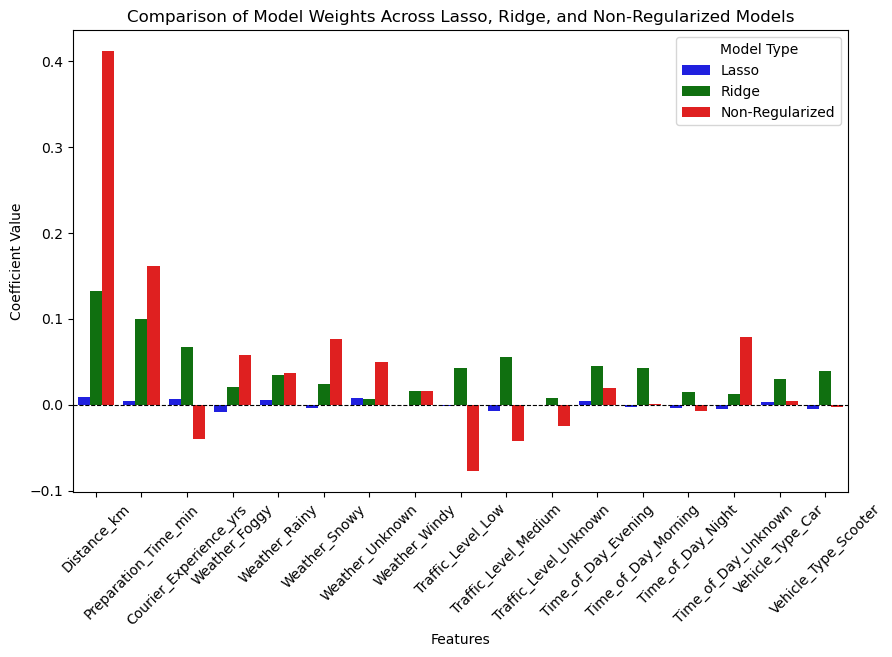

The features that have almost zero values:

1. Time of the day Morning. (for all three nearly)
2. Time of the day Evening. (for all except ridge)
3. Traffic Level (for all three nearly)

# Question 2

## Section 3.1 (Normal KNN)

`Task 1:` Classification

**Accuracy for three different values of k:**

`Accuracy for k = 1:` 90.48 %

`Accuracy for k = 5:` 91.9 %

`Accuracy for k = 10:` 92.07 %

**Accuracy when text embeddings are used:**

Accuracy = 87.81 %

`Task 1:` Retrieval

Part A:

- `Mean Reciprocal Rank:` 1.0
- `Precision@100:` 0.05
- `Hit Rate:` 1.0

Part B: Image to Image Retrieval:

- `Mean Reciprocal Rank:` 0.1935
- `Precision@100:` 0.018963
- `Hit Rate:` 0.9017

## Section 3.2 (Locally Sensitive Hashing)

Frequency of Samples in Each Bucket:

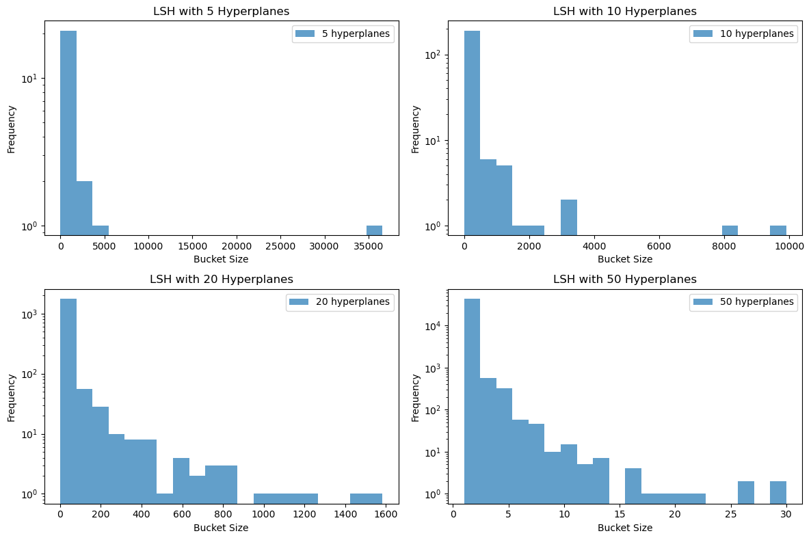

Problems I notice here:

I notice the problem that some buckets get a very large number of hyperplanes.

For Image to Image Retrieval:

- `Accuracy`: 89.99000000000001 %
- `Mean Reciprocal Rank`: 0.8999
- `Precision at k`: 0.04656300000000001
- `Hit Rate`: 0.9619

How do these metrics change, on changing the number of hyperplanes, mention possible reasons for these.

Increasing the Number of Hyperplanes

`Accuracy` increases because finer partitions reduce false positives. However, if too many hyperplanes are used, accuracy plateaus or slightly decreases due to over-segmentation.

`Mean Reciprocal Rank` improves as finer partitioning helps rank the correct results higher.

`Precision at k` improves since fewer irrelevant results are retrieved.

`Hit Rate` decreases because smaller hash buckets reduce recall, making relevant items less likely to be retrieved.

Decreasing the Number of Hyperplanes

`Accuracy` decreases because fewer partitions increase false positives.

`Mean Reciprocal Rank` decreases as incorrect items appear higher in rankings.

`Precision at k` decreases because more irrelevant results are retrieved.

`Hit Rate` increases as larger hash buckets improve recall, making relevant items more likely to be retrieved.

Reasons for These Changes

`More Hyperplanes → Higher Precision, Lower Recall`

More partitions create smaller hash buckets, reducing false positives but increasing false negatives.

`Fewer Hyperplanes → Higher Recall, Lower Precision`

Fewer partitions create larger hash buckets, increasing false positives but ensuring relevant items are included.

## Section 3.3 Inverted File Index

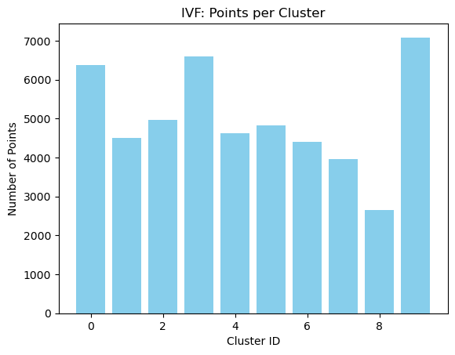

Statistics:

- IVF (nprobe=`1`): `MRR` = 0.9266, `Precision@100` = 0.8354, `Hit Rate` = 0.9985, `Avg Comparisons` = 5329.18
- IVF (nprobe=`2`): `MRR` = 0.9337, `Precision@100` = 0.8406, `Hit Rate` = 0.9991, `Avg Comparisons` = 10765.04
- IVF (nprobe=`5`): `MRR` = 0.9347, `Precision@100` = 0.8412, `Hit Rate` = 0.9995, `Avg Comparisons` = 26092.39
- IVF (nprobe=`10`): `MRR` = 0.9348, `Precision@100` = 0.8411, `Hit Rate` = 0.9996, `Avg Comparisons` = 50000.00

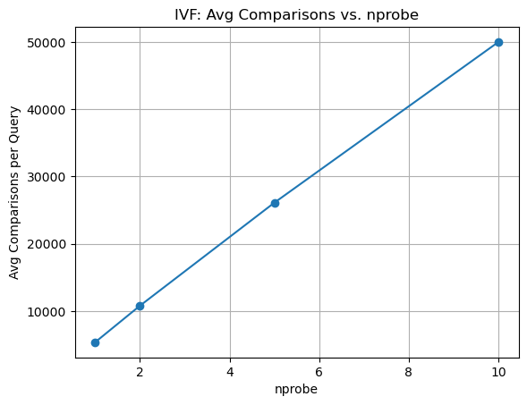

## Section 3.4: Analysis

Comparision of metrics: (both parts together)

IVF:

IVF (nprobe=1): MRR = 0.9266, Precision@100 = 0.8354, Hit Rate = 0.9985, Avg Comparisons = 5329.18

IVF (nprobe=2): MRR = 0.9337, Precision@100 = 0.8406, Hit Rate = 0.9991, Avg Comparisons = 10765.04

IVF (nprobe=5): MRR = 0.9347, Precision@100 = 0.8412, Hit Rate = 0.9995, Avg Comparisons = 26092.39

IVF (nprobe=10): MRR = 0.9348, Precision@100 = 0.8411, Hit Rate = 0.9996, Avg Comparisons = 50000.00

LSH: (for full train set at hyperplanes = 7)

Accuracy: 89.99000000000001 %
Mean Reciprocal Rank: 0.8999
Precision at k: 0.04656300000000001
Hit Rate: 0.9619

Simple k-means

Mean Reciprocal Rank: 0.1935
Precision@100: 0.018963
Hit Rate: 0.9017

# Question 3

## Section 4.1: Preprocessing and Exploratory Data Analysis

### Correlation matrix for the 12 features - excluding FLAG and Address

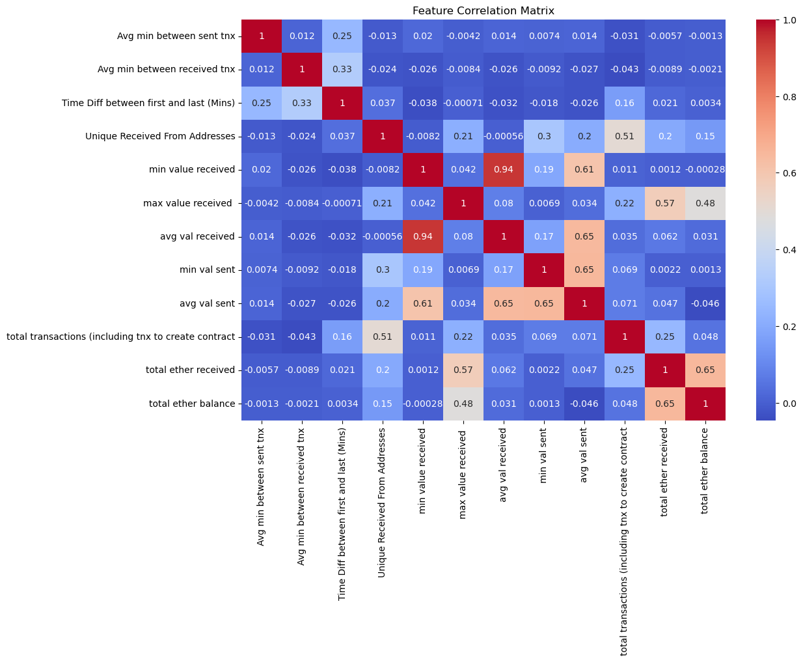

### Correlation matrix for the 13 features - excluding Address

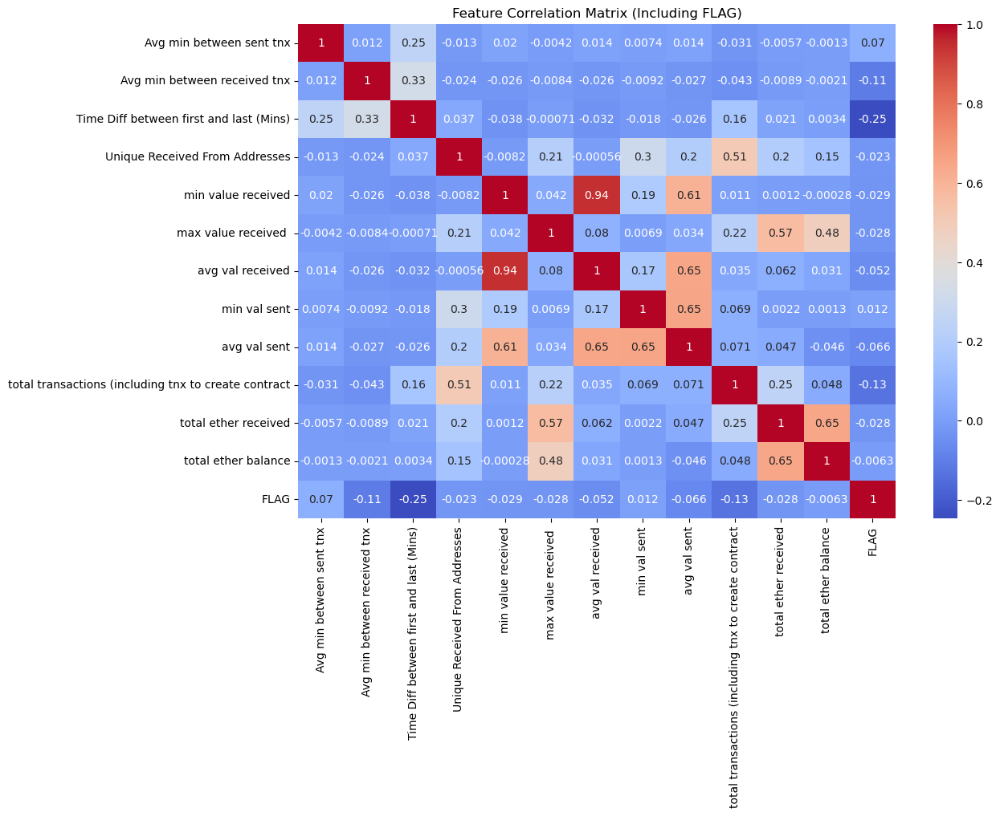

### Violin Plots for Data

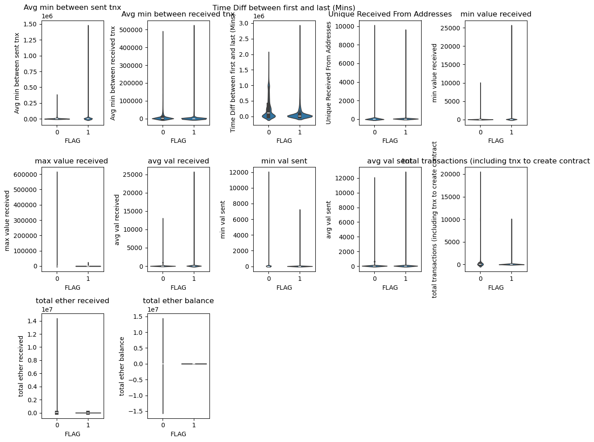

### Accuracies:

Own Implementation:

Decision Tree Test Accuracy: `0.8777817025785941`

Scikit Learn:

Scikit-Learn Decision Test Accuracy: `0.8784881667255386`

### Hyperparameter tuning Results

- {'criterion': 'gini', 'max_depth': 10, 'min_samples_split': 5, 'accuracy': 0.891832229580574}
- {'criterion': 'gini', 'max_depth': 10, 'min_samples_split': 20, 'accuracy': 0.891832229580574}
- {'criterion': 'gini', 'max_depth': None, 'min_samples_split': 5, 'accuracy': 0.8847682119205298}
- {'criterion': 'gini', 'max_depth': None, 'min_samples_split': 20, 'accuracy': 0.8874172185430463}

Best Parameters:

`Max Depth`: 10 / 11, `Min elements`: 3

`Max Depth`: 10, `Min elements`: 6

### Feature importances 

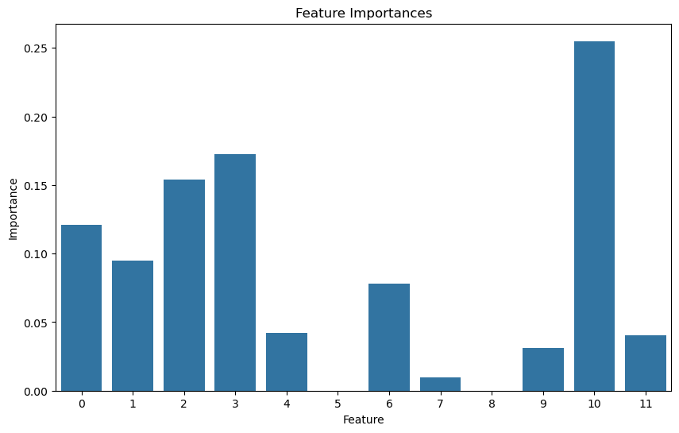

### Tree Visualisation

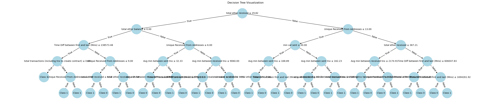

# Question 4:

### For different Values (parameters):

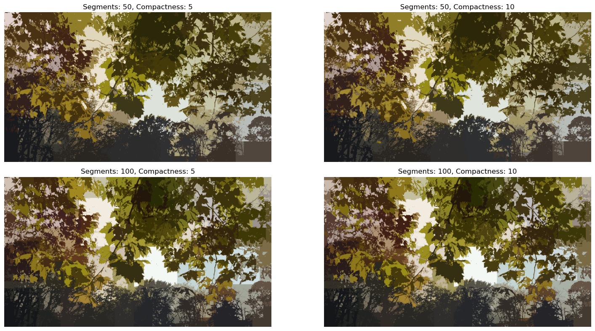

### Image displayed after every iteration

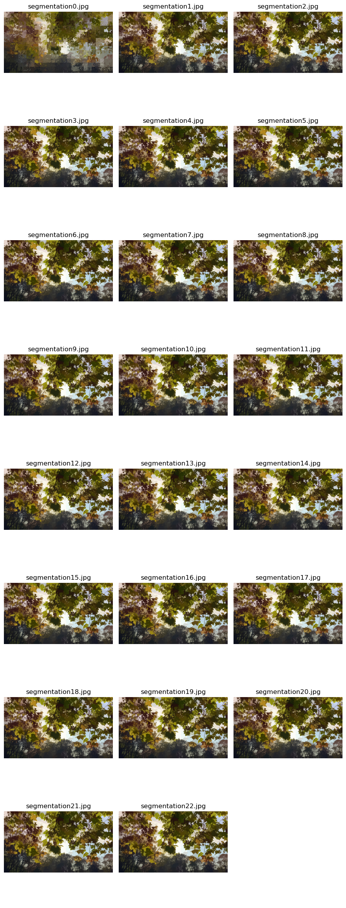

### SLIC RGB

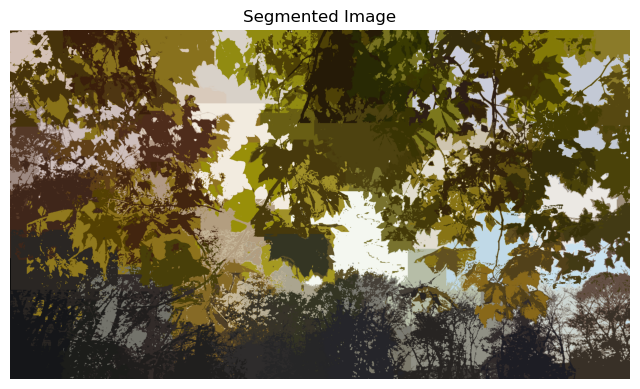

### Video Optimisation

The previously computed clusters were used.

### Statistics

Without optimisation:

Iterations taken (frame_wise): [32, 29, 30, 29, 25, 33, 26, 30, 23, 39, 36]
Average iterations: 30.181818181818183

With optimisation (2nd frame and onwards):

Iterations Taken: [18, 15, 9, 8, 12, 8, 12, 7, 16, 9]

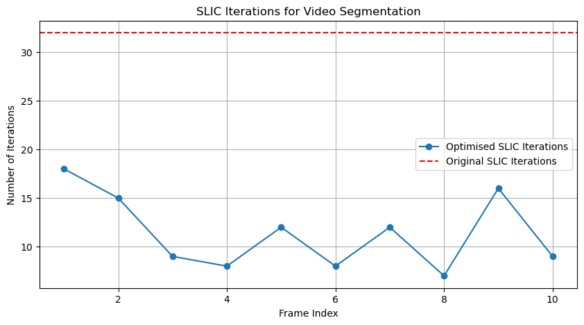
